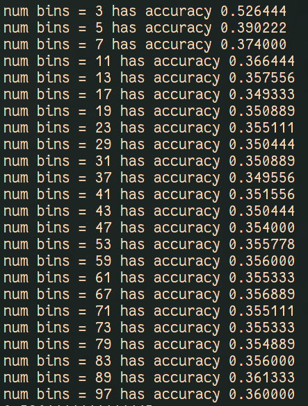
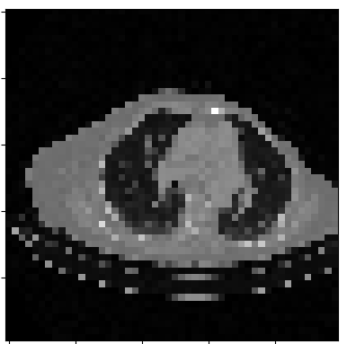
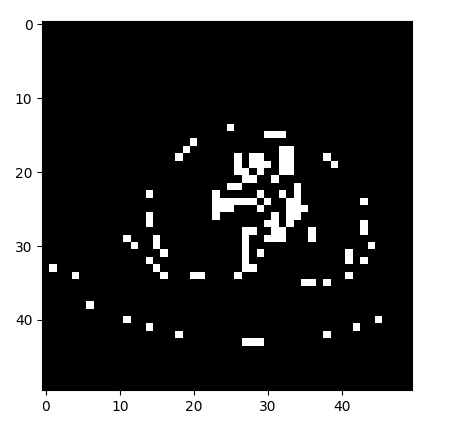
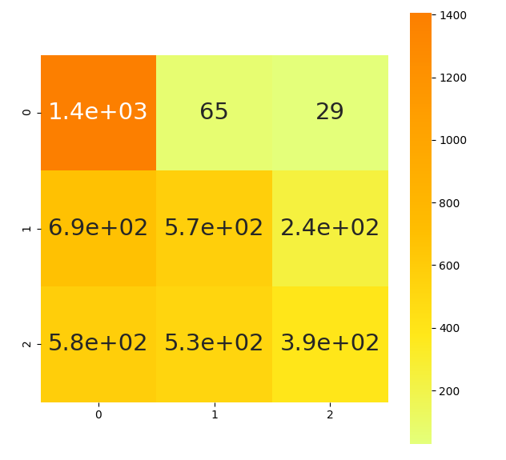
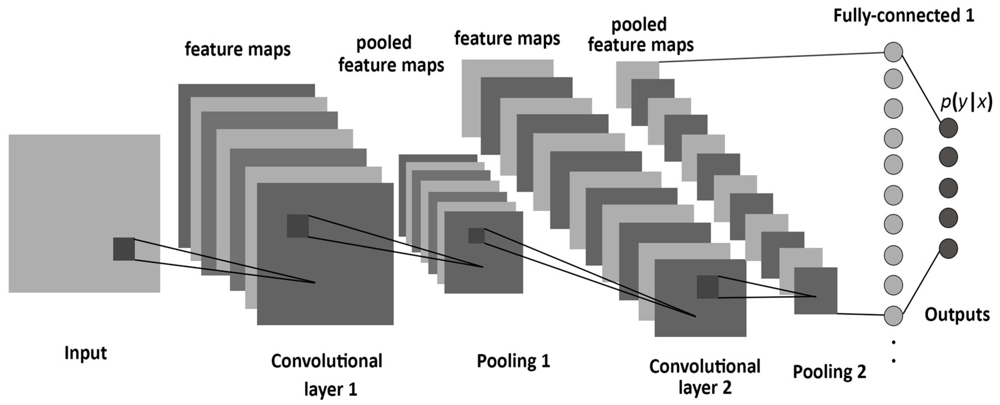
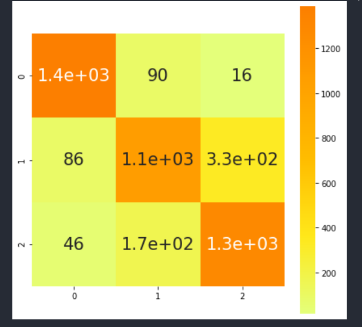
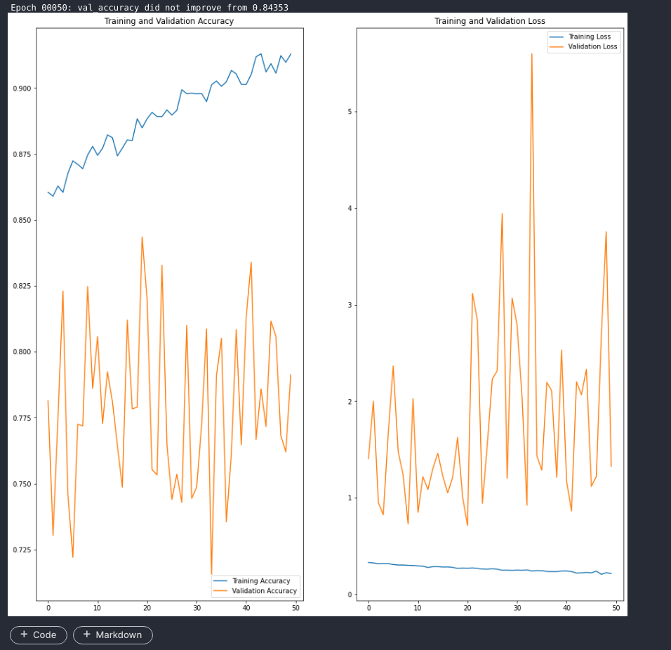
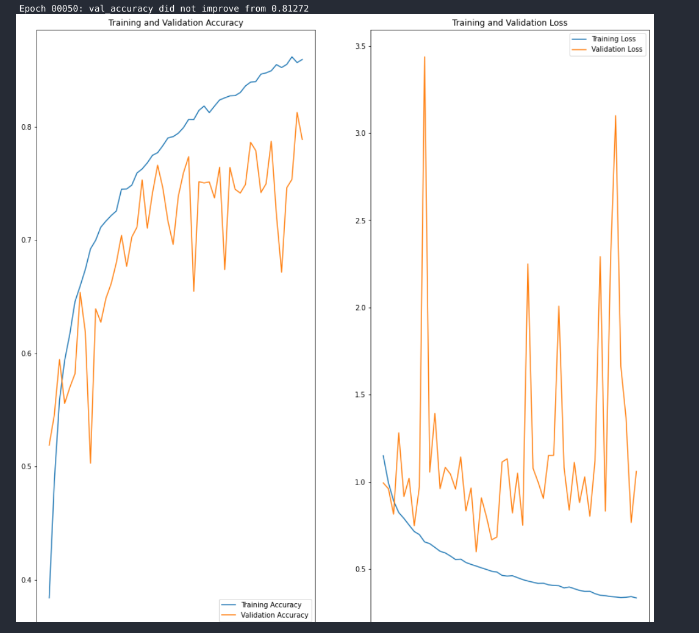

## CT Scan Classification - Classify CT scans according to their type ###
Stefan Radu - grupa 234

--- </br>

#### Descriere

Competitia presupunea clasificarea unor imagini de plamani obtinute prin
scanari CT (Computer Tomography) utilizan tehnici de machine learning. Am avut
la dispozitie 15000 de imagini de antrenare si 4500 de imagini de validare.
Testarea partiala se realiza pe 3900 de imagini necategorisite in prealabil.

#### Naive Bayes

Pentru inceput am vrut sa incerc prima tehnica cu care am luat contact, mai
precis folosind clasificatorul Naive Bayes. Este unul dintre cele mai simple
modele de machine learning, care are aplicatii in multe arii ale industriei in
ciuda usurintei de implementare. Previzibil, nu am obtinut rezultate
extraordinare, deoarece modelul trateaza trasaturile unei imagini (pixelii)
independent una fata de cealata, in ciuda faptului ca acestea sunt inrudite si
trebuie tratate in dependinta fata de vecini.  

Am testate intervale de diverse marimi si am obtinut acuratetea cea mai buna
pentru impartirea in doua intervale, si anume `52%`.  

<center></center> <center>_Acurateti pentru
Bayes_</center> </br>

<center></center>
<center>_Imaginea inainte de transformare_</center> </br>

<center></center>
<center>_Imaginea dupa transformare_</center> </br>

In final avem urmatoarea metrice de confuzie:

<center></center> <center>_matrice de
confuzie_</center> </br> </br>

Nu e rau, dar vrem mai bine de atat.


#### Pasii urmatori

Avand in vedere problema complexa de computer vision cu care avem de a face, ne
dam seama ca trebui gasita o metoda de a extrage anumite trasaturi cacteristice
fiecarei clase din fiecare imagine. Cu aceasta idee in minte ne dam seama ca un
MLP (Muli-Layer Perceptron) simplu nu ne-ar fi de mare folos intrucat ar fi
folosit ca date de intrare o imagine liniarizata, neputand extrage trasaturi
din aceasta.  

#### Straturi de convolutie

Asa ajungem la CNN-uri, mai precis Retele neuronale convolutionale, care sunt
folosite adesea pentru analiza si categorisirea diverselor tipuri de imagini.
Aspectul principal al unei asemenea retele il reprezinta straturile de
convolutie. Un strat de convoltie este format din multiple feature-map-uri
(care sunt doar niste reprezentari intermediare ale imaginii initiale care
intra in retea), care se obtin prin aplicare unor filtre / kerneluri asupra
inputului in stratul respectiv. Scopul layerelor acestora este de a extrage
treptat trasaturi din imagine, care sa ajute la categorisirea acestora.  

#### Activare (in particular RELU)

In general asupra straturilor de convolutie se aplica o functie de activare
*nonliniara*, deoarece acestea sunt liniare si trebuie separate intre ele. Cea
mai populara este RELU (`max(0, valoare)`) pentu ca are un computation overhead
foarte mic.  

#### Pooling

In general, dupa una sau mai multe convolutii se aplica un layer de pooling (o
forma non-liniara de down-sampling). Cu ajutorul uneia din mai multe metode
disponibile (max, average, min) au scopul de a reduce datele de intrare, prin
combinarea unui cluster mai mare de pixeli intr-un singur pixel.  

#### Dense Layers

Dupa multiple alternari de layere de convolutie si de pooling urmeaza sa
aplatizam datele (trasaturile extrase) intr-un singur strat, si sa il
introducem intr-o retea densa (practiv un MLP), care are scopul final de a
realiza clasificarea pe baza trasaturilor extrase in straturile de convolutie.  

#### In final

Ultimul strat va avea un numar de perceptroni egal cu numarul de clase intre
care vrem sa impartim datele noastre. Pentru a realiza aceasta impartire
utilizam in final functia de activare _softmax_ care are ca output
probabilitatea inputului de a fi in fiecare dintre cele 3 clase.  

<center></center> <center>_CNN_</center> </br> </br>


#### Arhitectura modelului

Voi folosi urmatoarele notatii in continuare:
* C27-3 -> convolutie cu 27 de filtre si dimensiune de filtru 3 MP -> strat de
* max pooling AP -> strat de average pooling D108 -> strat dens de cu 108
* perceptroni

In urma research-ului facut am inteles ca este ideal sa se inceapa cu un numar
mic de feature-uri per strat, iar acesta sa fie crescut incremental. Asadar am
inceput cu un strat de convolutie si am observat ce se intampla cu cat adaug
mai multe.

Am obtinut rezultate variate in felul urmator:

| Design | Acuratete | | :--- | :---: | | C27-3 MP D108 | ~54 | | C27-3 MP
C54-3 MP D108 | ~68 | | C27-3 MP C54-3 MP C108-3 MP D108 | ~72 | | C48-3 MP
C48-3 MP C96-3 MP D108 | ~71 | | C24-3 MP C48-3 MP C96-3 MP C120-3 MP D128 |
~71 | | C27-3 MP C54-3 MP C108-3 MP C216-3 MP D108 | ~74 |

M-am oprit la al 4-lea strat intrucat straturi suplimentare ar fi insemnat
procesare inutila in puls. In plus, nu as mai fi putut aplica inca o operatie
de max pooling intrucat feature-map-ul ar fi fost redus mult prea mult.

#### Prevenirea overfit-ului

Overfitting-ul este un fenomen extrem de comun in acest domeniu. Practic
modelul invata foarte bine datele de antrenament, dar esuaza in a realiza o
prezicere buna pe cazul general. Pentru a preveni acest fenomen am inceput sa
introduc metode regularizare, in principal dropout si augumentarea inpututlui.
Droputul presupune renuntarea aleatoare la diverse noduri pentru a introduce
variatie in invatatea modelui. Augumentare inputului presupune crearea
diversitatii in datele din intrare, prin aplicarea diverselor filtre pentru a
preveni invatarea _pe de rost_.

Am trecut prin urmatoarele etape:
* am introdus dropout dupa fiecare layer de convolutie 0.5.  am mai redus din
* dropout la ~0.3 si am scos dintre straturile de inceput 

* Am introdus batch normalization - care este o metoda de stabilizare a
* straturilor prin rescalare si si recentrare

Dupa aceste etape si mai mult trial and error am obtinut primul model si prima
submisie in valoare `81%` pe validare si `76%` pe testele de pe Kaggle.

In continuare am experimentat cu augumentarea datelor de intrare, vizualizant
in timp real rezultatele pentru a ma asigura ca nu introduc noise nenecesar in
retea.

* Initial am introdus brightness si zoom dar au dat rezultate nestisfacatoare
* `76% - 78%` pe validare Am introdus prima data vertical flip ca apoi sa imi
* dau seama la vizualizare ca avea efect diferit fata de ce credeam eu am
* introdus horizontal flip horizontal filp am variat brightness intre
* brightness 20% si 50% am variat zoom in 10% si 20% am incercat translatare pe
* OX si OY am reuntat complet la brightness si zoom am renuntat apoi la
* transaltate am introdus randomContrast care a avut un efect benefic am
* introdus random rotate In final am ajuns la shear_range cu care m-am jucat
* destul de mult

Configuratia finala de augumentare a fost de forma ``` shear_range=8,
horizontal_flip=True, vertical_flip=True, RandomContrast(factor=0.4,
input_shape=(50, 50, 1)), ``` Cu aceste schimbari am ajuns la o precizie de
`~82%` pe validare.  

Am experimentat cu average polling vs max polling, obtinand diferente de 1% in
favoare max polling.  M-am jucat cu learning rate-ul din Adam Optimizer, dar
l-am lasat default pana la urma, intrucat obtinarm rezultate si antrenari
instabile.

In continuare am experimentat cu experimentat cu strade de 2 pe ultimul layer
de convolutiesi cu diverse kernel size-ui (3 / 5).
* (2, 1), (2, 1), (3, 1), (3, 1) - ~82 (3, 1), (3, 1), (3, 2), (3, 1) - ~81 (3,
* 1), (3, 1), (3, 1), (3, 2) - ~81 (3, 1), (3, 1), (3, 1), (5, 1) - ~80 (3, 1),
* (3, 1), (3, 1), (3, 1) - ~83

Scorul final de `~84%` pe validare si `81%` pe testele preliminare din Kaggle
l-am obtinuat lasand doar 3 straturi de MaxPooling, eliminand-ul practic pe ce
dintre straturile initiale.

#### Arhitectura finala 

``` python RandomContrast(factor=0.4, input_shape=(50, 50, 1)),

Conv2D(filters=27, kernel_size=3, strides=1, activation='relu', \
input_shape=(50, 50, 1)), BatchNormalization(),

Conv2D(filters=54, kernel_size=3, strides=1, activation='relu'),
BatchNormalization(), MaxPooling2D(), Dropout(0.37),

Conv2D(filters=108, kernel_size=3, strides=1, activation='relu'),
BatchNormalization(), MaxPooling2D(),

Conv2D(filters=216, kernel_size=3, strides=1, activation='relu'),
BatchNormalization(), MaxPooling2D(), Dropout(0.37),

Flatten(), Dense(532, activation='relu'), Dropout(0.37), Dense(108,
activation='relu'), Dropout(0.37), Dense(27, activation='relu'), Dropout(0.37),
Dense(3, activation='softmax') ```

<center></center> <center>_Matricea de
confuzie_</center> </br>

<center></center> <center>_Prea multa augumentare -
acuratete instabila_</center> </br>

<center></center> <center>_Rezolvarea
problemei_</center> </br>
