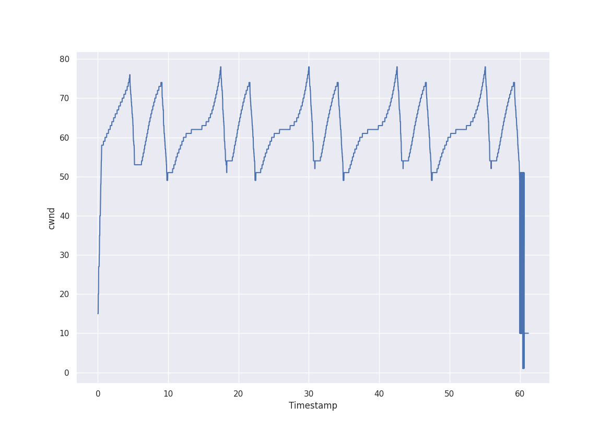

# Tema 2

- [Controlul congestiei (25%)](#congestion)
- Exercițiu la alegere (25%)
  - [Rutare](#rutare)
  - [HTTP API](#http)
- [ARP Spoofing (25%)](#arp_spoof)
- [TCP Hijacking (25%)](#tcp_hij)


<a name="congestion"></a> 
## 1. Controlul congestiei (25%)

### 1.1 Diagrama pentru RENO este:


- Slow Start
- Congestion Avoidance
- Fast Retransmit 
- Fast Recovery

### 1.2 Diagrame pentru ...

- Bbr


- Bic


- Cubic



<a name="http"></a> 
## 2. Exercițiu la alegere (25%)

<a name="http"></a> 
### HTTP API

Aplicația poate fi accesata la adresa:
```
http://ec2-3-88-187-87.compute-1.amazonaws.com/subnet
```

<a name="arp_spoof"></a> 
## 3. ARP Spoofing (25%)

Scrieți mesajele primite de server, client și printați acțiunile pe care le face middle.
```
make runarp                                                                                        ✔ 
docker-compose -f ../containers/docker-compose.yml exec middle bash -c 'python3 /elocal/arp-spoofing/spoofer.py'

[ Banana Spoofer ] Starting up...
Getting macs...
Begin emission:
Finished sending 1 packets.
*
Received 1 packets, got 1 answers, remaining 0 packets
Begin emission:
Finished sending 1 packets.
*
Received 1 packets, got 1 answers, remaining 0 packets
[Found] Target mac : 02:42:c6:0a:00:02
[Found] Gateway mac : 02:42:c6:0a:00:01
[Found] My MAC is 02:42:c6:0a:00:03
Poisoning... Ctrl+C to stop
[ARP] Ii spun lui 198.10.0.1 ca 198.10.0.2 se afla la 02:42:c6:0a:00:03 (mac-ul lui middle)
.
Sent 1 packets.
[ARP] Ii spun lui 198.10.0.2 ca 198.10.0.1 se afla la 02:42:c6:0a:00:03 (mac-ul lui middle)
.
Sent 1 packets.
[ARP] Ii spun lui 198.10.0.1 ca 198.10.0.2 se afla la 02:42:c6:0a:00:03 (mac-ul lui middle)
.
Sent 1 packets.
[ARP] Ii spun lui 198.10.0.2 ca 198.10.0.1 se afla la 02:42:c6:0a:00:03 (mac-ul lui middle)
.
Sent 1 packets.
// etc... pana la ctrl+c
```


```
make see 
docker-compose -f ../containers/docker-compose.yml exec server bash -c 'arp -a'
containers_router_1.containers_subnet2 (198.10.0.1) at 02:42:c6:0a:00:03 [ether] on eth0 // ...:03 e mac-ul lui middle defapt deci a mers
containers_middle_1.containers_subnet2 (198.10.0.3) at 02:42:c6:0a:00:03 [ether] on eth0
docker-compose -f ../containers/docker-compose.yml exec router bash -c 'arp -a'
adsl-172-10-1-1.dsl.sndg02.sbcglobal.net (172.10.1.1) at 02:42:2d:a5:67:f7 [ether] on eth0
containers_middle_1.containers_subnet2 (198.10.0.3) at 02:42:c6:0a:00:03 [ether] on eth1
containers_server_1.containers_subnet2 (198.10.0.2) at 02:42:c6:0a:00:03 [ether] on eth1 // ...:03 e mac-ul lui middle defapt deci a mers
```
Rulați pe `middle` comanda `tcpdump -SntvXX -i any` și salvați log-urile aici. Încercați să salvați doar cateva care conțin HTML-ul de la request-ul din server.

Am pus in `output.txt` tot ce am capturat.
```
IP (tos 0x0, ttl 47, id 0, offset 0, flags [DF], proto TCP (6), length 2788)
    193.226.51.15.80 > 198.10.0.3.56958: Flags [.], cksum 0xc5d5 (incorrect -> 0xa982), seq 4011026886:4011029622, ack 1481124552, win 1035, options [nop,nop,TS val 1684454960 ecr 7481007], length 2736: HTTP, length: 2736
    HTTP/1.1 200 OK
    Server: nginx/1.16.1
    Date: Thu, 10 Jun 2021 15:17:06 GMT
    Content-Type: text/html
    Content-Length: 5975
    Last-Modified: Fri, 15 May 2020 14:28:44 GMT
    Connection: keep-alive
    ETag: "5ebea71c-1757"
    Accept-Ranges: bytes
    
    <!DOCTYPE html
    PUBLIC "-//W3C//DTD XHTML 1.0 Transitional//EN"
    "http://www.w3.org/TR/xhtml1/DTD/xhtml1-transitional.dtd">
    <html>
        <head>
            <title>Facultatea de Matematica si Informatica / Faculty of Mathematics and Computer Science</title>
            
            <base href="http://old.fmi.unibuc.ro/" />
            <link rel="icon" href="http://old.fmi.unibuc.ro/favicon.ico" type="image/x-icon" />
            <link rel="shortcut icon" href="http://old.fmi.unibuc.ro/favicon.ico" type="image/x-icon" />
    
            <meta http-equiv="Content-Type" content="text/html; charset=iso-8859-1" />
            <script language="javascript" type="text/javascript">
                function hoverEnter1(obj)
                {obj.src = "i/romaniao.jpg";}
                function hoverEnter2(obj)
                {obj.src = "i/englisho.jpg";}
                function hoverExit1(obj)
                {obj.src = "i/romania.jpg";}
                function hoverExit2(obj)
                {obj.src = "i/english.jpg";}
                function randomImage()
                {    var x = document.getElementById("poza");
                    var i = Math.floor(Math.random() * 3);
                    var s = "url(i/fotografii"+(i+1)+".jpg) no-repeat top center";
                    x.style.background = s;}
            </script>
            
            <style type="text/css">
                body {
                    text-align: center;}
                #content {
                    font-family: Georgia, "Times New Roman", Times, serif;
                    margin-left: auto;
                    margin-right: auto;
                    text-align: center;}
                #textf {
                    margin-left: auto;
                    margin-right: auto;
                    text-indent: -2000000px;
                    width: 369px;
                    height: 159px;
                    background: url(i/logo.jpg) no-repeat top left;}
                #choose {
                    text-align: center;}
                #poza {
                    margin-left: auto;
                    margin-right: auto;
                    width: 684px;
                    height: 370px;
                    background: url(i/fotografii1.jpg) no-repeat top center;}
                #choose {
                    margin-top: 35px;}
                #choose ul {
                    padding: 0; margin: 0;}
                
                #choose li{
                    display: inline;
                    list-style-type: none;}
                
                #choose a {
                    text-decoration: none;
                    padding: 30px 10px;
                    color: black;}
                
                #romana {
                    background: url(i/romania.jpg) no-repeat top center;}
                
                #romana:hover {
                    background: url(i/romaniao.jpg) no-repeat top center;
                    text-decoration: underline;}
                
                #engleza {
                    background: url(i/english.jpg) no-repeat top center;}
                
                #engleza:hover {
                    background: url(i/englisho.jpg) no-repeat top center;
                    text-decoration: underline;}
                
                #meniu img{
                    border: 1px solid white;}
                #meniu img:hover {
                    border: 1px solid black;}
                #meniu p {
                    width: 8em;}
                #adresa {
                    font-size: 0.8em;}
                #pomelnic {
                    width: 600px;
                    margin-left: auto;
                    [!http]
    0x0000:  0000 0001 0006 0242 197e 6e5e 0000 0800  .......B.~n^....
    0x0010:  4500 0ae4 0000 4000 2f06 8615 c1e2 330f  E.....@./.....3.
    0x0020:  c60a 0003 0050 de7e ef13 69c6 5848 2ac8  .....P.~..i.XH*.
    0x0030:  8010 040b c5d5 0000 0101 080a 6466 be30  ............df.0
    0x0040:  0072 26af 4854 5450 2f31 2e31 2032 3030  .r&.HTTP/1.1.200
    0x0050:  204f 4b0d 0a53 6572 7665 723a 206e 6769  .OK..Server:.ngi
    0x0060:  6e78 2f31 2e31 362e 310d 0a44 6174 653a  nx/1.16.1..Date:
    0x0070:  2054 6875 2c20 3130 204a 756e 2032 3032  .Thu,.10.Jun.202
    0x0080:  3120 3135 3a31 373a 3036 2047 4d54 0d0a  1.15:17:06.GMT..
    0x0090:  436f 6e74 656e 742d 5479 7065 3a20 7465  Content-Type:.te
    0x00a0:  7874 2f68 746d 6c0d 0a43 6f6e 7465 6e74  xt/html..Content
    0x00b0:  2d4c 656e 6774 683a 2035 3937 350d 0a4c  -Length:.5975..L
    0x00c0:  6173 742d 4d6f 6469 6669 6564 3a20 4672  ast-Modified:.Fr
    0x00d0:  692c 2031 3520 4d61 7920 3230 3230 2031  i,.15.May.2020.1
    0x00e0:  343a 3238 3a34 3420 474d 540d 0a43 6f6e  4:28:44.GMT..Con
    0x00f0:  6e65 6374 696f 6e3a 206b 6565 702d 616c  nection:.keep-al
    0x0100:  6976 650d 0a45 5461 673a 2022 3565 6265  ive..ETag:."5ebe
    0x0110:  6137 3163 2d31 3735 3722 0d0a 4163 6365  a71c-1757"..Acce
    0x0120:  7074 2d52 616e 6765 733a 2062 7974 6573  pt-Ranges:.bytes
    0x0130:  0d0a 0d0a 3c21 444f 4354 5950 4520 6874  ....<!DOCTYPE.ht
    0x0140:  6d6c 0a50 5542 4c49 4320 222d 2f2f 5733  ml.PUBLIC."-//W3
    0x0150:  432f 2f44 5444 2058 4854 4d4c 2031 2e30  C//DTD.XHTML.1.0
    0x0160:  2054 7261 6e73 6974 696f 6e61 6c2f 2f45  .Transitional//E
    0x0170:  4e22 0a22 6874 7470 3a2f 2f77 7777 2e77  N"."http://www.w
    0x0180:  332e 6f72 672f 5452 2f78 6874 6d6c 312f  3.org/TR/xhtml1/
    0x0190:  4454 442f 7868 746d 6c31 2d74 7261 6e73  DTD/xhtml1-trans
    0x01a0:  6974 696f 6e61 6c2e 6474 6422 3e0a 3c68  itional.dtd">.<h
    0x01b0:  746d 6c3e 0a09 3c68 6561 643e 0a09 093c  tml>..<head>...<
    0x01c0:  7469 746c 653e 4661 6375 6c74 6174 6561  title>Facultatea
    0x01d0:  2064 6520 4d61 7465 6d61 7469 6361 2073  .de.Matematica.s
    0x01e0:  6920 496e 666f 726d 6174 6963 6120 2f20  i.Informatica./.
    0x01f0:  4661 6375 6c74 7920 6f66 204d 6174 6865  Faculty.of.Mathe
    0x0200:  6d61 7469 6373 2061 6e64 2043 6f6d 7075  matics.and.Compu
    0x0210:  7465 7220 5363 6965 6e63 653c 2f74 6974  ter.Science</tit
    0x0220:  6c65 3e0a 0909 0a09 093c 6261 7365 2068  le>......<base.h
    0x0230:  7265 663d 2268 7474 703a 2f2f 6f6c 642e  ref="http://old.
    0x0240:  666d 692e 756e 6962 7563 2e72 6f2f 2220  fmi.unibuc.ro/".
    0x0250:  2f3e 0a09 093c 6c69 6e6b 2072 656c 3d22  />...<link.rel="
    0x0260:  6963 6f6e 2220 6872 6566 3d22 6874 7470  icon".href="http
    0x0270:  3a2f 2f6f 6c64 2e66 6d69 2e75 6e69 6275  ://old.fmi.unibu
    0x0280:  632e 726f 2f66 6176 6963 6f6e 2e69 636f  c.ro/favicon.ico
    0x0290:  2220 7479 7065 3d22 696d 6167 652f 782d  ".type="image/x-
    0x02a0:  6963 6f6e 2220 2f3e 0a09 093c 6c69 6e6b  icon"./>...<link
    0x02b0:  2072 656c 3d22 7368 6f72 7463 7574 2069  .rel="shortcut.i
    0x02c0:  636f 6e22 2068 7265 663d 2268 7474 703a  con".href="http:
    0x02d0:  2f2f 6f6c 642e 666d 692e 756e 6962 7563  //old.fmi.unibuc
    0x02e0:  2e72 6f2f 6661 7669 636f 6e2e 6963 6f22  .ro/favicon.ico"
    0x02f0:  2074 7970 653d 2269 6d61 6765 2f78 2d69  .type="image/x-i
    0x0300:  636f 6e22 202f 3e0a 0a09 093c 6d65 7461  con"./>....<meta
    0x0310:  2068 7474 702d 6571 7569 763d 2243 6f6e  .http-equiv="Con
    0x0320:  7465 6e74 2d54 7970 6522 2063 6f6e 7465  tent-Type".conte
    0x0330:  6e74 3d22 7465 7874 2f68 746d 6c3b 2063  nt="text/html;.c
    0x0340:  6861 7273 6574 3d69 736f 2d38 3835 392d  harset=iso-8859-
    0x0350:  3122 202f 3e0a 0909 3c73 6372 6970 7420  1"./>...<script.
    0x0360:  6c61 6e67 7561 6765 3d22 6a61 7661 7363  language="javasc
    0x0370:  7269 7074 2220 7479 7065 3d22 7465 7874  ript".type="text
    0x0380:  2f6a 6176 6173 6372 6970 7422 3e0a 0909  /javascript">...
    0x0390:  0966 756e 6374 696f 6e20 686f 7665 7245  .function.hoverE
    0x03a0:  6e74 6572 3128 6f62 6a29 0a09 0909 7b6f  nter1(obj)....{o
    0x03b0:  626a 2e73 7263 203d 2022 692f 726f 6d61  bj.src.=."i/roma
    0x03c0:  6e69 616f 2e6a 7067 223b 7d0a 0909 0966  niao.jpg";}....f
    0x03d0:  756e 6374 696f 6e20 686f 7665 7245 6e74  unction.hoverEnt
    0x03e0:  6572 3228 6f62 6a29 0a09 0909 7b6f 626a  er2(obj)....{obj
    0x03f0:  2e73 7263 203d 2022 692f 656e 676c 6973  .src.=."i/englis
    0x0400:  686f 2e6a 7067 223b 7d0a 0909 0966 756e  ho.jpg";}....fun
    0x0410:  6374 696f 6e20 686f 7665 7245 7869 7431  ction.hoverExit1
    0x0420:  286f 626a 290a 0909 097b 6f62 6a2e 7372  (obj)....{obj.sr
    0x0430:  6320 3d20 2269 2f72 6f6d 616e 6961 2e6a  c.=."i/romania.j
    0x0440:  7067 223b 7d0a 0909 0966 756e 6374 696f  pg";}....functio
    0x0450:  6e20 686f 7665 7245 7869 7432 286f 626a  n.hoverExit2(obj
    0x0460:  290a 0909 097b 6f62 6a2e 7372 6320 3d20  )....{obj.src.=.
    0x0470:  2269 2f65 6e67 6c69 7368 2e6a 7067 223b  "i/english.jpg";
    0x0480:  7d0a 0909 0966 756e 6374 696f 6e20 7261  }....function.ra
    0x0490:  6e64 6f6d 496d 6167 6528 290a 0909 097b  ndomImage()....{
    0x04a0:  0976 6172 2078 203d 2064 6f63 756d 656e  .var.x.=.documen
    0x04b0:  742e 6765 7445 6c65 6d65 6e74 4279 4964  t.getElementById
    0x04c0:  2822 706f 7a61 2229 3b0a 0909 0909 7661  ("poza");.....va
    0x04d0:  7220 6920 3d20 4d61 7468 2e66 6c6f 6f72  r.i.=.Math.floor
    0x04e0:  284d 6174 682e 7261 6e64 6f6d 2829 202a  (Math.random().*
    0x04f0:  2033 293b 0a09 0909 0976 6172 2073 203d  .3);.....var.s.=
    0x0500:  2022 7572 6c28 692f 666f 746f 6772 6166  ."url(i/fotograf
    0x0510:  6969 222b 2869 2b31 292b 222e 6a70 6729  ii"+(i+1)+".jpg)
    0x0520:  206e 6f2d 7265 7065 6174 2074 6f70 2063  .no-repeat.top.c
    0x0530:  656e 7465 7222 3b0a 0909 0909 782e 7374  enter";.....x.st
    0x0540:  796c 652e 6261 636b 6772 6f75 6e64 203d  yle.background.=
    0x0550:  2073 3b7d 0a09 093c 2f73 6372 6970 743e  .s;}...</script>
    0x0560:  0a09 090a 0909 3c73 7479 6c65 2074 7970  ......<style.typ
    0x0570:  653d 2274 6578 742f 6373 7322 3e0a 0909  e="text/css">...
    0x0580:  0962 6f64 7920 7b0a 0909 0909 7465 7874  .body.{.....text
    0x0590:  2d61 6c69 676e 3a20 6365 6e74 6572 3b7d  -align:.center;}
    0x05a0:  0a09 0909 2363 6f6e 7465 6e74 207b 0a09  ....#content.{..
    0x05b0:  0909 0966 6f6e 742d 6661 6d69 6c79 3a20  ...font-family:.
    0x05c0:  4765 6f72 6769 612c 2022 5469 6d65 7320  Georgia,."Times.
    0x05d0:  4e65 7720 526f 6d61 6e22 2c20 5469 6d65  New.Roman",.Time
    0x05e0:  732c 2073 6572 6966 3b0a 0909 0909 6d61  s,.serif;.....ma
    0x05f0:  7267 696e 2d6c 6566 743a 2061 7574 6f3b  rgin-left:.auto;
    0x0600:  0a09 0909 096d 6172 6769 6e2d 7269 6768  .....margin-righ
    0x0610:  743a 2061 7574 6f3b 0a09 0909 0974 6578  t:.auto;.....tex
    0x0620:  742d 616c 6967 6e3a 2063 656e 7465 723b  t-align:.center;
    0x0630:  7d0a 0909 0923 7465 7874 6620 7b0a 0909  }....#textf.{...
    0x0640:  0909 6d61 7267 696e 2d6c 6566 743a 2061  ..margin-left:.a
    0x0650:  7574 6f3b 0a09 0909 096d 6172 6769 6e2d  uto;.....margin-
    0x0660:  7269 6768 743a 2061 7574 6f3b 0a09 0909  right:.auto;....
    0x0670:  0974 6578 742d 696e 6465 6e74 3a20 2d32  .text-indent:.-2
    0x0680:  3030 3030 3030 7078 3b0a 0909 0909 7769  000000px;.....wi
    0x0690:  6474 683a 2033 3639 7078 3b0a 0909 0909  dth:.369px;.....
    0x06a0:  6865 6967 6874 3a20 3135 3970 783b 0a09  height:.159px;..
    0x06b0:  0909 0962 6163 6b67 726f 756e 643a 2075  ...background:.u
    0x06c0:  726c 2869 2f6c 6f67 6f2e 6a70 6729 206e  rl(i/logo.jpg).n
    0x06d0:  6f2d 7265 7065 6174 2074 6f70 206c 6566  o-repeat.top.lef
    0x06e0:  743b 7d0a 0909 0923 6368 6f6f 7365 207b  t;}....#choose.{
    0x06f0:  0a09 0909 0974 6578 742d 616c 6967 6e3a  .....text-align:
    0x0700:  2063 656e 7465 723b 7d0a 0909 0923 706f  .center;}....#po
    0x0710:  7a61 207b 0a09 0909 096d 6172 6769 6e2d  za.{.....margin-
    0x0720:  6c65 6674 3a20 6175 746f 3b0a 0909 0909  left:.auto;.....
    0x0730:  6d61 7267 696e 2d72 6967 6874 3a20 6175  margin-right:.au
    0x0740:  746f 3b0a 0909 0909 7769 6474 683a 2036  to;.....width:.6
    0x0750:  3834 7078 3b0a 0909 0909 6865 6967 6874  84px;.....height
    0x0760:  3a20 3337 3070 783b 0a09 0909 0962 6163  :.370px;.....bac
    0x0770:  6b67 726f 756e 643a 2075 726c 2869 2f66  kground:.url(i/f
    0x0780:  6f74 6f67 7261 6669 6931 2e6a 7067 2920  otografii1.jpg).
    0x0790:  6e6f 2d72 6570 6561 7420 746f 7020 6365  no-repeat.top.ce
    0x07a0:  6e74 6572 3b7d 0a09 0909 2363 686f 6f73  nter;}....#choos
    0x07b0:  6520 7b0a 0909 0909 6d61 7267 696e 2d74  e.{.....margin-t
    0x07c0:  6f70 3a20 3335 7078 3b7d 0a09 0909 2363  op:.35px;}....#c
    0x07d0:  686f 6f73 6520 756c 207b 0a09 0909 0970  hoose.ul.{.....p
    0x07e0:  6164 6469 6e67 3a20 303b 206d 6172 6769  adding:.0;.margi
    0x07f0:  6e3a 2030 3b7d 0a09 0909 0a09 0909 2363  n:.0;}........#c
    0x0800:  686f 6f73 6520 6c69 7b0a 0909 0909 6469  hoose.li{.....di
    0x0810:  7370 6c61 793a 2069 6e6c 696e 653b 0a09  splay:.inline;..
    0x0820:  0909 096c 6973 742d 7374 796c 652d 7479  ...list-style-ty
    0x0830:  7065 3a20 6e6f 6e65 3b7d 0a09 0909 0a09  pe:.none;}......
    0x0840:  0909 2363 686f 6f73 6520 6120 7b0a 0909  ..#choose.a.{...
    0x0850:  0909 7465 7874 2d64 6563 6f72 6174 696f  ..text-decoratio
    0x0860:  6e3a 206e 6f6e 653b 0a09 0909 0970 6164  n:.none;.....pad
    0x0870:  6469 6e67 3a20 3330 7078 2031 3070 783b  ding:.30px.10px;
    0x0880:  0a09 0909 0963 6f6c 6f72 3a20 626c 6163  .....color:.blac
    0x0890:  6b3b 7d0a 0909 090a 0909 0923 726f 6d61  k;}........#roma
    0x08a0:  6e61 207b 0a09 0909 0962 6163 6b67 726f  na.{.....backgro
    0x08b0:  756e 643a 2075 726c 2869 2f72 6f6d 616e  und:.url(i/roman
    0x08c0:  6961 2e6a 7067 2920 6e6f 2d72 6570 6561  ia.jpg).no-repea
    0x08d0:  7420 746f 7020 6365 6e74 6572 3b7d 0a09  t.top.center;}..
    0x08e0:  0909 0a09 0909 2372 6f6d 616e 613a 686f  ......#romana:ho
    0x08f0:  7665 7220 7b0a 0909 0909 6261 636b 6772  ver.{.....backgr
    0x0900:  6f75 6e64 3a20 7572 6c28 692f 726f 6d61  ound:.url(i/roma
    0x0910:  6e69 616f 2e6a 7067 2920 6e6f 2d72 6570  niao.jpg).no-rep
    0x0920:  6561 7420 746f 7020 6365 6e74 6572 3b0a  eat.top.center;.
    0x0930:  0909 0909 7465 7874 2d64 6563 6f72 6174  ....text-decorat
    0x0940:  696f 6e3a 2075 6e64 6572 6c69 6e65 3b7d  ion:.underline;}
    0x0950:  0a09 0909 0a09 0909 2365 6e67 6c65 7a61  ........#engleza
    0x0960:  207b 0a09 0909 0962 6163 6b67 726f 756e  .{.....backgroun
    0x0970:  643a 2075 726c 2869 2f65 6e67 6c69 7368  d:.url(i/english
    0x0980:  2e6a 7067 2920 6e6f 2d72 6570 6561 7420  .jpg).no-repeat.
    0x0990:  746f 7020 6365 6e74 6572 3b7d 0a09 0909  top.center;}....
    0x09a0:  0a09 0909 2365 6e67 6c65 7a61 3a68 6f76  ....#engleza:hov
    0x09b0:  6572 207b 0a09 0909 0962 6163 6b67 726f  er.{.....backgro
    0x09c0:  756e 643a 2075 726c 2869 2f65 6e67 6c69  und:.url(i/engli
    0x09d0:  7368 6f2e 6a70 6729 206e 6f2d 7265 7065  sho.jpg).no-repe
    0x09e0:  6174 2074 6f70 2063 656e 7465 723b 0a09  at.top.center;..
    0x09f0:  0909 0974 6578 742d 6465 636f 7261 7469  ...text-decorati
    0x0a00:  6f6e 3a20 756e 6465 726c 696e 653b 7d0a  on:.underline;}.
    0x0a10:  0909 090a 0909 0923 6d65 6e69 7520 696d  .......#meniu.im
    0x0a20:  677b 0a09 0909 0962 6f72 6465 723a 2031  g{.....border:.1
    0x0a30:  7078 2073 6f6c 6964 2077 6869 7465 3b7d  px.solid.white;}
    0x0a40:  0a09 0909 236d 656e 6975 2069 6d67 3a68  ....#meniu.img:h
    0x0a50:  6f76 6572 207b 0a09 0909 0962 6f72 6465  over.{.....borde
    0x0a60:  723a 2031 7078 2073 6f6c 6964 2062 6c61  r:.1px.solid.bla
    0x0a70:  636b 3b7d 0a09 0909 236d 656e 6975 2070  ck;}....#meniu.p
    0x0a80:  207b 0a09 0909 0977 6964 7468 3a20 3865  .{.....width:.8e
    0x0a90:  6d3b 7d0a 0909 0923 6164 7265 7361 207b  m;}....#adresa.{
    0x0aa0:  0a09 0909 0966 6f6e 742d 7369 7a65 3a20  .....font-size:.
    0x0ab0:  302e 3865 6d3b 7d0a 0909 0923 706f 6d65  0.8em;}....#pome
    0x0ac0:  6c6e 6963 207b 0a09 0909 0977 6964 7468  lnic.{.....width
    0x0ad0:  3a20 3630 3070 783b 0a09 0909 096d 6172  :.600px;.....mar
    0x0ae0:  6769 6e2d 6c65 6674 3a20 6175 746f 3b0a  gin-left:.auto;.
    0x0af0:  0909 0909                                ....
// etc........
```
Puteți pune și capturi de ecran din wireshark prin orice alte metode de prezentare.

<a name="tcp_hij"></a> 
## 4. TCP Hijacking (25%)
Scrieție mesajele primite de server, client și printați acțiunile pe care le face middle.

### Pe server
```
docker-compose -f ../containers/docker-compose.yml exec server bash -c 'python3 /elocal/tcp_hijacking/tcp_server.py'
[LINE:18]# INFO     [2021-06-16 10:55:45,403]  Serverul a pornit pe 0.0.0.0 si portnul portul 10000
[LINE:20]# INFO     [2021-06-16 10:55:45,404]  Asteptam conexiui...
[LINE:22]# INFO     [2021-06-16 10:56:20,697]  Handshake cu ('198.10.0.3', 53102)
[LINE:28]# INFO     [2021-06-16 10:56:20,702]  Serverul primeste: b'ecnerefretni'
[LINE:28]# INFO     [2021-06-16 10:56:21,717]  Serverul primeste: b'eviecrep'
[LINE:28]# INFO     [2021-06-16 10:56:22,734]  Serverul primeste: b'etavacxe'
[LINE:28]# INFO     [2021-06-16 10:56:23,749]  Serverul primeste: b'etavacxe'
[LINE:28]# INFO     [2021-06-16 10:56:24,762]  Serverul primeste: b'noiterces'
[LINE:28]# INFO     [2021-06-16 10:56:25,776]  Serverul primeste: b'ecnerefretni'
[LINE:28]# INFO     [2021-06-16 10:56:26,789]  Serverul primeste: b'etatupma'
[LINE:28]# INFO     [2021-06-16 10:56:27,801]  Serverul primeste: b'hguot'
[LINE:28]# INFO     [2021-06-16 10:56:28,814]  Serverul primeste: b'ecnatculer'
[LINE:28]# INFO     [2021-06-16 10:56:29,829]  Serverul primeste: b'amoc'
[LINE:28]# INFO     [2021-06-16 10:56:30,844]  Serverul primeste: b'llor'
[LINE:28]# INFO     [2021-06-16 10:56:31,856]  Serverul primeste: b'cigetarts'
[LINE:28]# INFO     [2021-06-16 10:56:32,870]  Serverul primeste: b'etavacxe'
[LINE:28]# INFO     [2021-06-16 10:56:33,884]  Serverul primeste: b'etapicitrap'
[LINE:28]# INFO     [2021-06-16 10:56:34,896]  Serverul primeste: b'elcihev'
[LINE:28]# INFO     [2021-06-16 10:56:35,908]  Serverul primeste: b'ecnatculer'
[LINE:28]# INFO     [2021-06-16 10:56:36,922]  Serverul primeste: b'latsyrc'
[LINE:28]# INFO     [2021-06-16 10:56:37,934]  Serverul primeste: b'ytilatipsoh'
[LINE:28]# INFO     [2021-06-16 10:56:38,944]  Serverul primeste: b'noitaitogen'
[LINE:28]# INFO     [2021-06-16 10:56:39,954]  Serverul primeste: b'latsyrc'
[LINE:28]# INFO     [2021-06-16 10:56:40,968]  Serverul primeste: b'lennahc'
[LINE:28]# INFO     [2021-06-16 10:56:41,977]  Serverul primeste: b'sserpxe'
[LINE:28]# INFO     [2021-06-16 10:56:42,991]  Serverul primeste: b'drohc'
...
```

### Pe client
```
docker-compose -f ../containers/docker-compose.yml exec client bash -c 'python3 /elocal/tcp_hijacking/tcp_client.py'
[LINE:35]# INFO     [2021-06-16 10:55:48,927]  Handshake cu ('198.10.0.2', 10000)
[LINE:41]# INFO     [2021-06-16 10:56:20,693]  Clientul trimite: b'interference'
[LINE:44]# INFO     [2021-06-16 10:56:20,709]  Clientul primeste: b'Server a primit mesajul: ecnerefretni'
[LINE:41]# INFO     [2021-06-16 10:56:21,711]  Clientul trimite: b'perceive'
[LINE:44]# INFO     [2021-06-16 10:56:21,724]  Clientul primeste: b'Server a primit mesajul: eviecrep'
[LINE:41]# INFO     [2021-06-16 10:56:22,727]  Clientul trimite: b'excavate'
[LINE:44]# INFO     [2021-06-16 10:56:22,742]  Clientul primeste: b'Server a primit mesajul: etavacxe'
[LINE:41]# INFO     [2021-06-16 10:56:23,743]  Clientul trimite: b'excavate'
[LINE:44]# INFO     [2021-06-16 10:56:23,754]  Clientul primeste: b'Server a primit mesajul: etavacxe'
[LINE:41]# INFO     [2021-06-16 10:56:24,755]  Clientul trimite: b'secretion'
[LINE:44]# INFO     [2021-06-16 10:56:24,767]  Clientul primeste: b'Server a primit mesajul: noiterces'
[LINE:41]# INFO     [2021-06-16 10:56:25,768]  Clientul trimite: b'interference'
[LINE:44]# INFO     [2021-06-16 10:56:25,781]  Clientul primeste: b'Server a primit mesajul: ecnerefretni'
[LINE:41]# INFO     [2021-06-16 10:56:26,782]  Clientul trimite: b'amputate'
[LINE:44]# INFO     [2021-06-16 10:56:26,793]  Clientul primeste: b'Server a primit mesajul: etatupma'
[LINE:41]# INFO     [2021-06-16 10:56:27,795]  Clientul trimite: b'tough'
[LINE:44]# INFO     [2021-06-16 10:56:27,806]  Clientul primeste: b'Server a primit mesajul: hguot'
[LINE:41]# INFO     [2021-06-16 10:56:28,807]  Clientul trimite: b'reluctance'
[LINE:44]# INFO     [2021-06-16 10:56:28,819]  Clientul primeste: b'Server a primit mesajul: ecnatculer'
[LINE:41]# INFO     [2021-06-16 10:56:29,822]  Clientul trimite: b'coma'
[LINE:44]# INFO     [2021-06-16 10:56:29,834]  Clientul primeste: b'Server a primit mesajul: amoc'
[LINE:41]# INFO     [2021-06-16 10:56:30,837]  Clientul trimite: b'roll'
[LINE:44]# INFO     [2021-06-16 10:56:30,847]  Clientul primeste: b'Server a primit mesajul: llor'
[LINE:41]# INFO     [2021-06-16 10:56:31,848]  Clientul trimite: b'strategic'
[LINE:44]# INFO     [2021-06-16 10:56:31,860]  Clientul primeste: b'Server a primit mesajul: cigetarts'
[LINE:41]# INFO     [2021-06-16 10:56:32,862]  Clientul trimite: b'excavate'
[LINE:44]# INFO     [2021-06-16 10:56:32,875]  Clientul primeste: b'Server a primit mesajul: etavacxe'
[LINE:41]# INFO     [2021-06-16 10:56:33,877]  Clientul trimite: b'participate'
[LINE:44]# INFO     [2021-06-16 10:56:33,888]  Clientul primeste: b'Server a primit mesajul: etapicitrap'
[LINE:41]# INFO     [2021-06-16 10:56:34,890]  Clientul trimite: b'vehicle'
[LINE:44]# INFO     [2021-06-16 10:56:34,900]  Clientul primeste: b'Server a primit mesajul: elcihev'
[LINE:41]# INFO     [2021-06-16 10:56:35,902]  Clientul trimite: b'reluctance'
[LINE:44]# INFO     [2021-06-16 10:56:35,913]  Clientul primeste: b'Server a primit mesajul: ecnatculer'
[LINE:41]# INFO     [2021-06-16 10:56:36,915]  Clientul trimite: b'crystal'
[LINE:44]# INFO     [2021-06-16 10:56:36,926]  Clientul primeste: b'Server a primit mesajul: latsyrc'
[LINE:41]# INFO     [2021-06-16 10:56:37,928]  Clientul trimite: b'hospitality'
[LINE:44]# INFO     [2021-06-16 10:56:37,939]  Clientul primeste: b'Server a primit mesajul: ytilatipsoh'
[LINE:41]# INFO     [2021-06-16 10:56:38,940]  Clientul trimite: b'negotiation'
[LINE:44]# INFO     [2021-06-16 10:56:38,947]  Clientul primeste: b'Server a primit mesajul: noitaitogen'
[LINE:41]# INFO     [2021-06-16 10:56:39,948]  Clientul trimite: b'crystal'
[LINE:44]# INFO     [2021-06-16 10:56:39,960]  Clientul primeste: b'Server a primit mesajul: latsyrc'
[LINE:41]# INFO     [2021-06-16 10:56:40,962]  Clientul trimite: b'channel'
[LINE:44]# INFO     [2021-06-16 10:56:40,970]  Clientul primeste: b'Server a primit mesajul: lennahc'
[LINE:41]# INFO     [2021-06-16 10:56:41,971]  Clientul trimite: b'express'
[LINE:44]# INFO     [2021-06-16 10:56:41,982]  Clientul primeste: b'Server a primit mesajul: sserpxe'
[LINE:41]# INFO     [2021-06-16 10:56:42,984]  Clientul trimite: b'chord'
[LINE:44]# INFO     [2021-06-16 10:56:42,995]  Clientul primeste: b'Server a primit mesajul: drohc'
...
```

### Pe Middle
```
docker-compose -f ../containers/docker-compose.yml exec middle bash -c 'python3 /elocal/tcp_hijacking/intercepter.py'
before: IP / TCP 198.10.0.1:53102 > 198.10.0.2:webmin PA / Raw b'interference'
after: IP / TCP 198.10.0.1:53102 > 198.10.0.2:webmin PA / Raw b'ecnerefretni'
before: IP / TCP 198.10.0.1:53102 > 198.10.0.2:webmin PA / Raw b'perceive'
after: IP / TCP 198.10.0.1:53102 > 198.10.0.2:webmin PA / Raw b'eviecrep'
before: IP / TCP 198.10.0.1:53102 > 198.10.0.2:webmin PA / Raw b'excavate'
after: IP / TCP 198.10.0.1:53102 > 198.10.0.2:webmin PA / Raw b'etavacxe'
before: IP / TCP 198.10.0.1:53102 > 198.10.0.2:webmin PA / Raw b'excavate'
after: IP / TCP 198.10.0.1:53102 > 198.10.0.2:webmin PA / Raw b'etavacxe'
before: IP / TCP 198.10.0.1:53102 > 198.10.0.2:webmin PA / Raw b'secretion'
after: IP / TCP 198.10.0.1:53102 > 198.10.0.2:webmin PA / Raw b'noiterces'
before: IP / TCP 198.10.0.1:53102 > 198.10.0.2:webmin PA / Raw b'interference'
after: IP / TCP 198.10.0.1:53102 > 198.10.0.2:webmin PA / Raw b'ecnerefretni'
before: IP / TCP 198.10.0.1:53102 > 198.10.0.2:webmin PA / Raw b'amputate'
after: IP / TCP 198.10.0.1:53102 > 198.10.0.2:webmin PA / Raw b'etatupma'
before: IP / TCP 198.10.0.1:53102 > 198.10.0.2:webmin PA / Raw b'tough'
after: IP / TCP 198.10.0.1:53102 > 198.10.0.2:webmin PA / Raw b'hguot'
before: IP / TCP 198.10.0.1:53102 > 198.10.0.2:webmin PA / Raw b'reluctance'
after: IP / TCP 198.10.0.1:53102 > 198.10.0.2:webmin PA / Raw b'ecnatculer'
before: IP / TCP 198.10.0.1:53102 > 198.10.0.2:webmin PA / Raw b'coma'
after: IP / TCP 198.10.0.1:53102 > 198.10.0.2:webmin PA / Raw b'amoc'
before: IP / TCP 198.10.0.1:53102 > 198.10.0.2:webmin PA / Raw b'roll'
after: IP / TCP 198.10.0.1:53102 > 198.10.0.2:webmin PA / Raw b'llor'
before: IP / TCP 198.10.0.1:53102 > 198.10.0.2:webmin PA / Raw b'strategic'
after: IP / TCP 198.10.0.1:53102 > 198.10.0.2:webmin PA / Raw b'cigetarts'
before: IP / TCP 198.10.0.1:53102 > 198.10.0.2:webmin PA / Raw b'excavate'
after: IP / TCP 198.10.0.1:53102 > 198.10.0.2:webmin PA / Raw b'etavacxe'
before: IP / TCP 198.10.0.1:53102 > 198.10.0.2:webmin PA / Raw b'participate'
after: IP / TCP 198.10.0.1:53102 > 198.10.0.2:webmin PA / Raw b'etapicitrap'
before: IP / TCP 198.10.0.1:53102 > 198.10.0.2:webmin PA / Raw b'vehicle'
after: IP / TCP 198.10.0.1:53102 > 198.10.0.2:webmin PA / Raw b'elcihev'
before: IP / TCP 198.10.0.1:53102 > 198.10.0.2:webmin PA / Raw b'reluctance'
after: IP / TCP 198.10.0.1:53102 > 198.10.0.2:webmin PA / Raw b'ecnatculer'
before: IP / TCP 198.10.0.1:53102 > 198.10.0.2:webmin PA / Raw b'crystal'
after: IP / TCP 198.10.0.1:53102 > 198.10.0.2:webmin PA / Raw b'latsyrc'
before: IP / TCP 198.10.0.1:53102 > 198.10.0.2:webmin PA / Raw b'hospitality'
after: IP / TCP 198.10.0.1:53102 > 198.10.0.2:webmin PA / Raw b'ytilatipsoh'
before: IP / TCP 198.10.0.1:53102 > 198.10.0.2:webmin PA / Raw b'negotiation'
after: IP / TCP 198.10.0.1:53102 > 198.10.0.2:webmin PA / Raw b'noitaitogen'
before: IP / TCP 198.10.0.1:53102 > 198.10.0.2:webmin PA / Raw b'crystal'
after: IP / TCP 198.10.0.1:53102 > 198.10.0.2:webmin PA / Raw b'latsyrc'
before: IP / TCP 198.10.0.1:53102 > 198.10.0.2:webmin PA / Raw b'hospitality'
after: IP / TCP 198.10.0.1:53102 > 198.10.0.2:webmin PA / Raw b'ytilatipsoh'
before: IP / TCP 198.10.0.1:53102 > 198.10.0.2:webmin PA / Raw b'negotiation'
after: IP / TCP 198.10.0.1:53102 > 198.10.0.2:webmin PA / Raw b'noitaitogen'
before: IP / TCP 198.10.0.1:53102 > 198.10.0.2:webmin PA / Raw b'crystal'
after: IP / TCP 198.10.0.1:53102 > 198.10.0.2:webmin PA / Raw b'latsyrc'
before: IP / TCP 198.10.0.1:53102 > 198.10.0.2:webmin PA / Raw b'channel'
after: IP / TCP 198.10.0.1:53102 > 198.10.0.2:webmin PA / Raw b'lennahc'
before: IP / TCP 198.10.0.1:53102 > 198.10.0.2:webmin PA / Raw b'express'
after: IP / TCP 198.10.0.1:53102 > 198.10.0.2:webmin PA / Raw b'sserpxe'
before: IP / TCP 198.10.0.1:53102 > 198.10.0.2:webmin PA / Raw b'chord'
after: IP / TCP 198.10.0.1:53102 > 198.10.0.2:webmin PA / Raw b'drohc'
...
```
