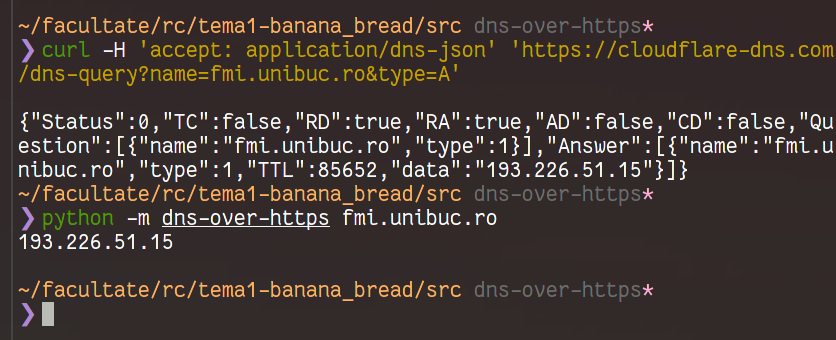
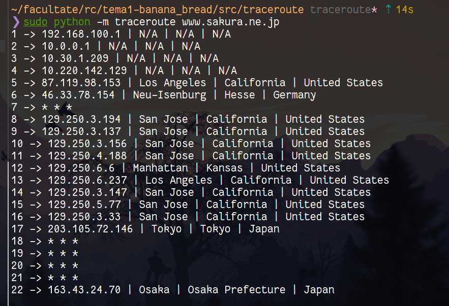
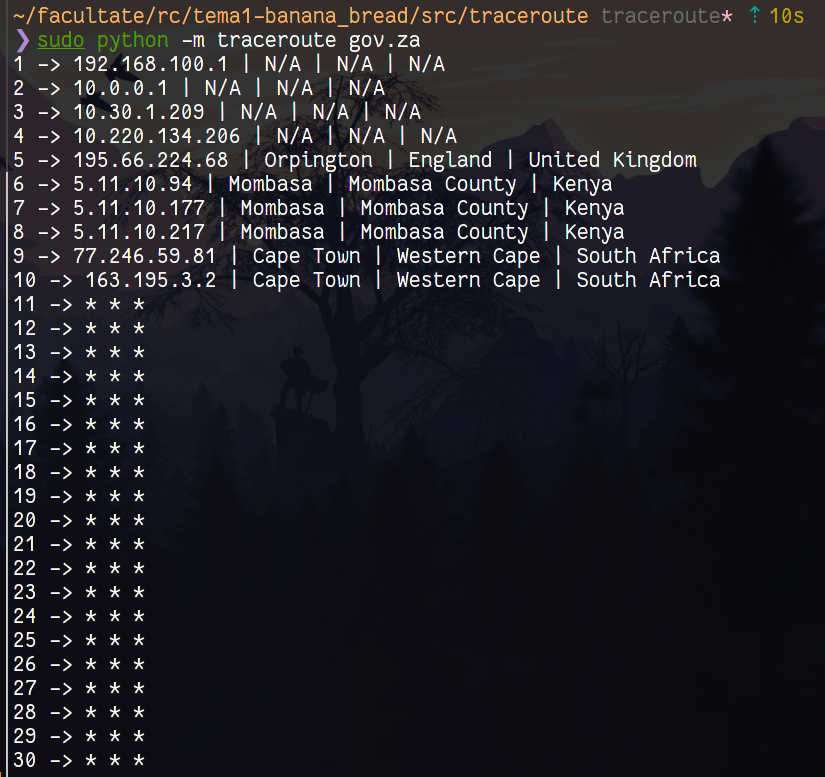
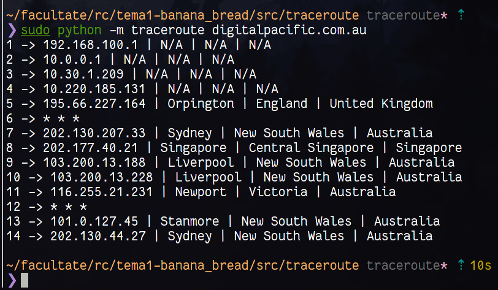

# Soluție

## 1. DNS over HTTPS

Prima data am citit documentatia si am testat endpoint-ul prin curl:
```bash
curl -H 'accept: application/dns-json' 'https://cloudflare-dns.com/dns-query?name=netflix.com&type=A'
curl -H 'accept: application/dns-json' 'https://cloudflare-dns.com/dns-query?name=netflix.com&type=CNAME' 
curl -H 'accept: application/dns-json' 'https://cloudflare-dns.com/dns-query?name=google.com&type=TXT'
```
Am trecut apoi la implementarea in `python` unde am folosit pachetul `requests` pentru cererea efective, respectiv `json` pentru decodare.

Am implementat soluția [aici](./src/dns-over-https/__main__.py)

Aici e un exemplu de execuție:
``` bash
python -m dns-over-https example.com
# afiseaza 93.184.216.34
```



## 2. Traceroute

### Implementarea solutiei: subpunctul 1

Pentru a implementa functia care obtine datele despre localizarea unui IP am folosit API-ul de geolocatie de la RapidAPI (https://ip-geolocation-ipwhois-io.p.rapidapi.com).

Am creat un fisier config unde am pus variabilele request-ului (printre care si secretul, motiv pentru care am pus fisierul in gitignore). Dupa aceea, am pus datele in dictionare pt header, request body si am trimis request-ul, dupa care am extras din raspuns datele care ne interesau (oras,regiune,tara) si le-am returnat.

### Subpunctul 2
Solutia se foloseste de faptul ca in momentul in care TTL ajunge pe 1 nodul va trimite inapoi catre origine mesajul TTL_EXCEEDED. Cum TTL scade cu fiecare hop, trimitand requesturi cu TTL progresiv crescator (intai 1, apoi 2, 3, etc.) pana cand se ajunge la destinatie voi primi inapoi cate un raspuns tip ICMP de la fiecare nod intermediar.

Asadar, cu un while trimit progresiv requesturi UDP cu TTL=1..30 si astept pe socket-ul de ICMP raspuns. Am urmatoarele situatii:
* Primesc raspuns: iau tipul raspunsului (dau skip headerului (aflu lungimea headerului: bitii 4-8 din primul octet), apoi iau primul octet de dupa header -> tipul de raspuns). De ce fac asta? Deoarece raspunsul venit contine si headerul basic IP. 
    * Raspuns 11 => TTL_EXCEEDED => continuam
    * Raspuns 3 => DESTINATION_UNREACHABLE => s-a ajuns la destinatie 
* Nu primesc raspuns => probabil timeout

In functie de aceasta procesare, daca am primit inapoi raspuns ii iau ip-ul si il trec prin functia de la subpunctul 1 si afisez datele despre locatie. Altfel, imit behavior-ul utilitarului traceroute si afisez "* * *" (am observat ca unele adrese nu trimit niciodata DESTINATION_UNREACHABLE iar in cazul acela ne vom opri dupa 30 hopuri.)


### Ruta către Japonia - sakura.ne.jp


### Ruta către Africa de Sud - gov.za



### Ruta către Australia - digitalpacific.com.au



## 3. Reliable UDP

### Inceputuri

Am inceput acest exercitiu prin completarea functiilor helper, iar research-ul despre acestea ne-a dat o idee despre cum trebuie implementate emitatorul/receptorul.

### Parcursul implementarii

In prima faza am facut ca atat emitatorul cat si receptorul sa isi poata trimite mesajul de tip S, respectiv ACK-ul corespunzator.

Cele 3 functii din emitator au structura similara:
 * Formam header-ul folosind functiile din helper
 * atasam payload-ul, daca e cazul (mesaj tip P), sau numele fisierului sursa, daca e request tip F (la sfarsit, in receptor, verific ca fisierul sursa si fisierul dest sa fie identice, si pot sa fac asta deoarece cele doua containere impart /elocal)
 * calculam checksum-ul si formam mesajul final
 * trimitem mesajul si asteptam raspuns. luam timpul de dinainte sa trimit mesajul si de dupa ce am primit raspunsul si calculez adaptive timeout-ul
 * verific ca raspunsul sa fie okay (chksum), daca nu e ok, discard
 * actualizez timeout-ul calculat cu formulele de adaptive

Am folosit stop-and-wait (trimit cate 1 pachet si astept raspuns de la server ca a fost primit ok inainte sa-l trimit pe urmatorul)
Iar main-ul urmeaza scheletul de cod dat ca exemplu.

Pe parte de receptor:
* astept sa primesc mesaj
* cand primesc, separ header-ul de payload si-l procesez
* in functie de tipul de mesaj compun raspunsul conform specificatiei din tema
    * cel mai important e la tipul P unde modific ack_nr adaugand numarul de bytes pe care l-am scris in fisier
* daca chksum e gresit nu mai scriu nimic si dau discard
* trimit raspunsul inapoi catre emitator
* cand primesc F, verific daca cele 2 fisiere sunt la fel (dau diff si iau status code-ul) si afisez daca acest lucru este adevarat, apoi am ales sa inchid receptorul


### Emițător - mesaje de logging

```
[LINE:38]# INFO     [2021-04-05 20:23:06,740]                    Am trimis connect catre server...
[LINE:47]# INFO     [2021-04-05 20:23:06,834]                    Am primit raspuns! :D
[LINE:57]# INFO     [2021-04-05 20:23:06,834]                    Ack Nr: "2101177070"
[LINE:58]# INFO     [2021-04-05 20:23:06,834]                    Checksum: "6096"
[LINE:59]# INFO     [2021-04-05 20:23:06,834]                    Window: "4"

[LINE:145]# INFO     [2021-04-05 20:23:06,834]                    Am trimis pachet catre server...
[LINE:154]# INFO     [2021-04-05 20:23:06,928]                    Primit ack, si e bun :D
[LINE:158]# INFO     [2021-04-05 20:23:06,928]                    Trimis cu succes!
[LINE:163]# INFO     [2021-04-05 20:23:06,928]                    Ack Nr: "2101178470"
[LINE:164]# INFO     [2021-04-05 20:23:06,928]                    Checksum: "4698"
[LINE:165]# INFO     [2021-04-05 20:23:06,928]                    Window: "2"
........
[LINE:145]# INFO     [2021-04-05 20:23:16,929]                    Am trimis pachet catre server...
[LINE:156]# WARNING  [2021-04-05 20:23:17,052]                    Timeout la trimitere, retrying...
[LINE:145]# INFO     [2021-04-05 20:23:17,052]                    Am trimis pachet catre server...
[LINE:154]# INFO     [2021-04-05 20:23:17,152]                    Primit ack, si e bun :D
[LINE:158]# INFO     [2021-04-05 20:23:17,152]                    Trimis cu succes!
[LINE:163]# INFO     [2021-04-05 20:23:17,152]                    Ack Nr: "2101290470"
[LINE:164]# INFO     [2021-04-05 20:23:17,152]                    Checksum: "23768"
[LINE:165]# INFO     [2021-04-05 20:23:17,152]                    Window: "2"
[LINE:166]# INFO     [2021-04-05 20:23:17,152]                    

[LINE:145]# INFO     [2021-04-05 20:23:17,152]                    Am trimis pachet catre server...
[LINE:154]# INFO     [2021-04-05 20:23:17,262]                    Primit ack, si e bun :D
[LINE:158]# INFO     [2021-04-05 20:23:17,262]                    Trimis cu succes!
[LINE:163]# INFO     [2021-04-05 20:23:17,262]                    Ack Nr: "2101291319"
[LINE:164]# INFO     [2021-04-05 20:23:17,262]                    Checksum: "22919"
[LINE:165]# INFO     [2021-04-05 20:23:17,262]                    Window: "2"
[LINE:166]# INFO     [2021-04-05 20:23:17,262]                    
```

### Receptor - mesaje de logging

```
[LINE:53]# INFO     [2021-04-05 20:22:54,331]                    Serverul a pornit pe 0.0.0.0 si portnul portul 10000
[LINE:58]# INFO     [2021-04-05 20:22:54,331]                    Asteptam mesaje...
[LINE:109]# INFO     [2021-04-05 20:23:06,740]                    b'' ...
[LINE:58]# INFO     [2021-04-05 20:23:06,740]                    Asteptam mesaje...
[LINE:109]# INFO     [2021-04-05 20:23:06,835]                    b'Lorem ipsum dolor sit amet,' ...
[LINE:58]# INFO     [2021-04-05 20:23:06,835]                    Asteptam mesaje...
[LINE:109]# INFO     [2021-04-05 20:23:06,929]                    b' Morbi tincidunt augue inte' ...
[LINE:58]# INFO     [2021-04-05 20:23:06,929]                    Asteptam mesaje...
[LINE:109]# INFO     [2021-04-05 20:23:07,036]                    b' mi quis. Pellentesque mass' ...
[LINE:58]# INFO     [2021-04-05 20:23:07,036]                    Asteptam mesaje...

.....

[LINE:58]# INFO     [2021-04-05 20:23:17,053]                    Asteptam mesaje...
[LINE:109]# INFO     [2021-04-05 20:23:17,153]                    b'pis tincidunt id aliquet ri' ...
[LINE:58]# INFO     [2021-04-05 20:23:17,153]                    Asteptam mesaje...
/elocal/start.txt
[LINE:97]# INFO     [2021-04-05 20:23:17,263]                    Fisier gata! Pa-pa!
[LINE:102]# INFO     [2021-04-05 20:23:17,265]                    Fisierele sunt identice!
```

Am facut si sliding window
